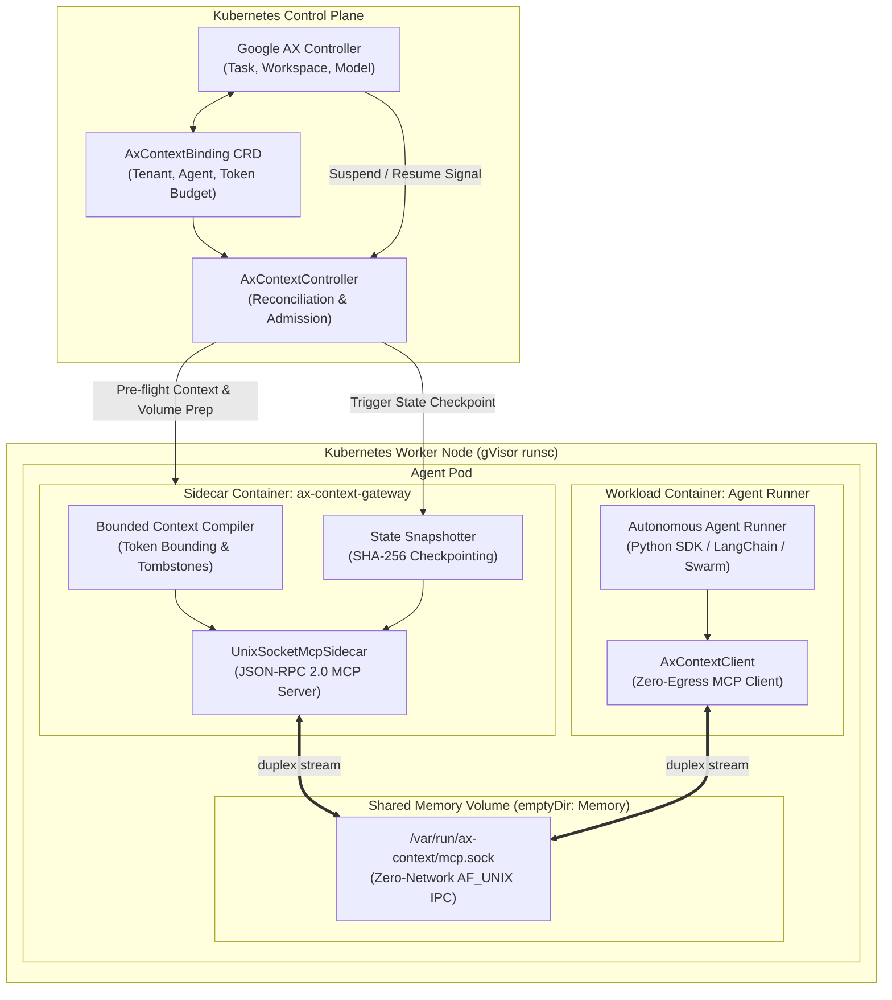
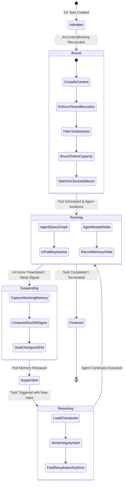
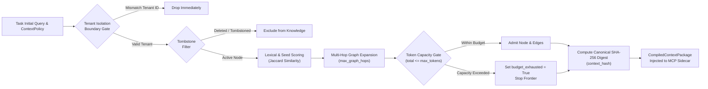
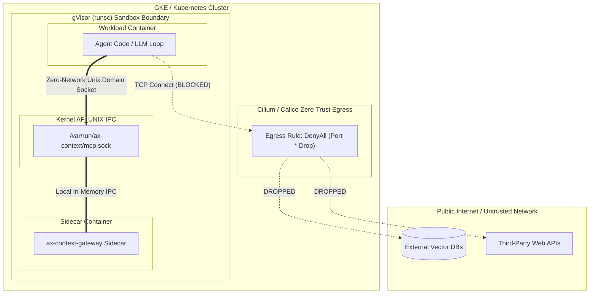

# ax-context-gateway
> **Kubernetes-native Context & Memory Gateway Sidecar for Google AX (Agent Executor)**

[](LICENSE)
[]()
[]()
[]()

`ax-context-gateway` is a production reference controller and sidecar that bridges [Swarm-Context-Commander](https://github.com/AAH20/Swarm-Context-Commander)'s bounded context compilation and token admission with [Google AX](https://github.com/google/ax)'s declarative agent orchestrator on Kubernetes.

---

## Architecture & System Overview

Google AX introduces declarative Kubernetes primitives (`Task`, `Workspace`, `Gateway`, `Model`) and the **Agent Substrate** runtime for high-density, stateful agent multiplexing. Agents run in gVisor (`runsc`) sandboxes under strict zero-trust network policies (`egress: mode: DenyAll`).

`ax-context-gateway` resolves the fundamental friction between zero-trust sandboxing and stateful memory retrieval by serving pre-flight compiled context and state synchronization over an in-pod Unix Domain Socket Model Context Protocol (MCP) stream.

### 1. High-Level System Architecture



---

## Task & Context Lifecycle State Machine

The gateway aligns directly with the **Google AX Agent Substrate** lifecycle states:



---

## Context Compilation & Token Bounding Pipeline

Context is compiled deterministically prior to container unfreezing, ensuring zero cross-tenant contamination:



---

## Network Topology & Security Boundaries

In contrast to traditional agent architectures that make external network calls to retrieve memory, `ax-context-gateway` maintains an airtight perimeter:



---

## Declarative Manifests

### 1. `AxContextBinding` Custom Resource
```yaml
apiVersion: agent.google.com/v1alpha1
kind: AxContextBinding
metadata:
  name: incident-analyst-task-42-binding
  namespace: agent-workloads
spec:
  targetTaskRef:
    name: incident-analyst-task-42
  tenantId: enterprise-acme-corp
  agentId: secops-reconciliation-agent
  contextPolicy:
    maxContextTokens: 4096
    maxGraphHops: 2
    similarityThreshold: 0.75
    enforceTombstones: true
  snapshotConfig:
    autoCheckpointOnSuspend: true
    storageUri: "s3://acme-agent-snapshots/secops-reconciliation-agent/"
```

### 2. Google AX `Task` Manifest
```yaml
apiVersion: agent.google.com/v1alpha1
kind: Task
metadata:
  name: incident-analyst-task-42
  namespace: agent-workloads
spec:
  modelRef:
    name: gemini-2-5-pro
  workspaceRef:
    name: analyst-scratchpad-ws
  runtimeClass: gvisor # runsc sandbox isolation
  networkPolicy:
    egress:
      mode: DenyAll # Strict Zero-Trust
  template:
    containers:
      - name: agent-runner
        image: ghcr.io/aah20/autonomous-analyst:v1.0.0
        env:
          - name: MCP_SOCKET_PATH
            value: /var/run/ax-context/mcp.sock
        volumeMounts:
          - name: ax-context-socket
            mountPath: /var/run/ax-context
    volumes:
      - name: ax-context-socket
        emptyDir:
          medium: Memory
```

---

## Python Client SDK Usage

Agents inside the container use `AxContextClient` with zero boilerplate:

```python
from ax_context_gateway.client import AxContextClient

# Auto-detects $MCP_SOCKET_PATH
client = AxContextClient.from_env()

# 1. Fetch pre-flight compiled context & graph
context = client.get_bounded_context()
print(f"Admitted tokens: {context['total_tokens']} (Hash: {context['context_hash']})")

# 2. Query in-memory graph without network access
nodes = client.query_memory_graph(keyword="database credentials")

# 3. Record state mutations before AX suspension
client.record_memory_delta(key="incident_status", value="mitigation_in_progress")

# 4. Inspect session metrics & budget
metrics = client.get_session_metrics()
print("Session metrics:", metrics)
```

---

## Automated Conformance & Security Drills

The repository includes `AxContextEvaluator` to audit multi-tenant boundaries and benchmark rehydration latency:

```bash
PYTHONPATH=projects python3 -m ax_context_gateway.evaluator
```

```json
{
  "suite": "ax_context_gateway_conformance_eval",
  "all_passed": true,
  "drills": [
    {
      "test_name": "tenant_isolation_leak_drill",
      "passed": true,
      "victim_tenant": "tenant-bank-corp",
      "attacker_tenant": "tenant-adversary",
      "leaked_count": 0,
      "status": "SECURE"
    },
    {
      "test_name": "token_starvation_bounding_drill",
      "passed": true,
      "max_budget": 500,
      "total_admitted_tokens": 500,
      "admitted_node_count": 10,
      "budget_exhausted": true,
      "status": "BOUNDED"
    },
    {
      "test_name": "rehydration_latency_benchmark",
      "passed": true,
      "checkpoint_latency_microseconds": 360.83,
      "avg_rehydration_microseconds": 96.56,
      "min_rehydration_microseconds": 60.58,
      "max_rehydration_microseconds": 401.33,
      "iterations": 50,
      "status": "OPTIMAL (<5ms)"
    }
  ]
}
```

---

## Running the Unit Test Suite

```bash
PYTHONPATH=projects python3 -m unittest discover -s projects/ax_context_gateway/tests -v
```

```text
test_client_duplex_session (test_evaluator.TestEvaluatorAndClient.test_client_duplex_session) ... ok
test_evaluator_drills (test_evaluator.TestEvaluatorAndClient.test_evaluator_drills) ... ok
test_suspension_checkpoint_and_rehydration (test_gateway.TestAxContextGateway.test_suspension_checkpoint_and_rehydration) ... ok
test_tampered_checkpoint_rejection (test_gateway.TestAxContextGateway.test_tampered_checkpoint_rejection) ... ok
test_tenant_isolation_and_tombstones (test_gateway.TestAxContextGateway.test_tenant_isolation_and_tombstones) ... ok
test_token_budget_enforcement (test_gateway.TestAxContextGateway.test_token_budget_enforcement) ... ok
test_unix_socket_mcp_zero_egress (test_gateway.TestAxContextGateway.test_unix_socket_mcp_zero_egress) ... ok

Ran 7 tests in 0.019s (OK)
```

---

## License
Apache-2.0
